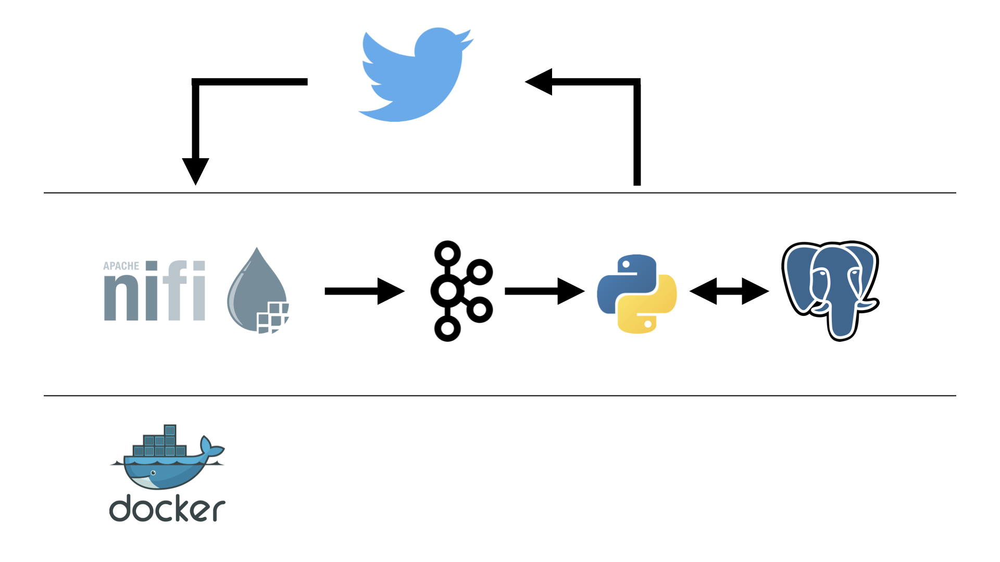
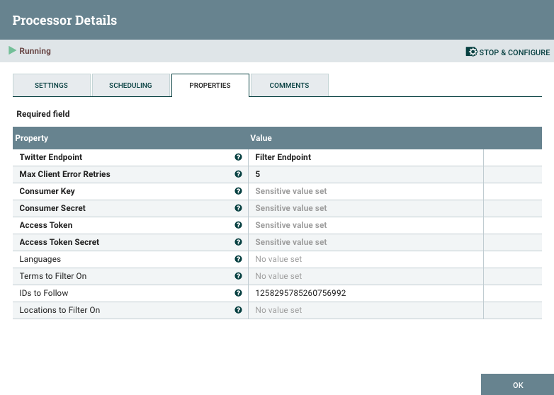
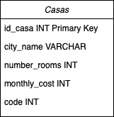

# kiribati-dp2

# Equipo KIRIBATI 
* [Lluis LLoret](https://github.com/luisllll)
* [Marco Colapietro](https://github.com/Marcolapietro)
* [Gonzalo Alberola](https://github.com/GonzaloAP97)
* [Marta Álvarez](https://github.com/maalal)
* [Borja Ponz](https://github.com/fbponz)

# 1) kiribati-dp2

Objetivo del proyecto, es disponer de la capacidad de leer información de una cuenta de Twitter y responder en el menor tiempo posible. Hay tres tipos de tweets:
- Cliente -> Donde se nos indica el nombre del cliente, su edad, miembros de la familia, sueldo y hobbies.
- Casas -> Donde se indica la localización de la casa, el coste de alquiler mensual y un código de la vivienda.
- Empleos -> Lista de empleos con sueldo neto.

Una vez leídos los tweets, se cruza la información obtenida y se busca el mejor match de las opciones disponibles. Se responde al tweet de cliente, tan rápido como sea posible. El algoritmo para hacer match está descrito en el algoritmo 2.3. 

## 1.1) Video 
Enlace video demostrativo del MVP.
 

# 2) MVP
## 2.1) Arquitectura 
Para la resolución de la problemática planteada hemos decidido implementar la siguiente arquitectura.
 

 
NIFI: El objetivo principal es poder ingestar los datos a través de la API que nos proporciona Twitter. Una vez recibimos respuesta de la API tenemos que filtrar por un lado los tweets que no nos interesan y también datos que no interesan para la ejecución de la aplicación. También segregamos los tweets en dos tipos Clientes y Casas. Se ha escogido Nifi por la versatilidad que nos ofrece para realizar prototipos y ajustarnos a unas necesidades cambiantes.

Kafka: Kafka, nos permite realizar una gestión de eventos en tiempo real, añade una latencia baja al sistema y nos permite comunicar las diferentes aplicaciones que componen nuestra arquitectura. En esta aplicación vamos a tener dos topics, uno de ellos incluirá los tweets de los clientes y otro tweets los datos de las casas.

Python: Con el objetivo de probar el concepto de hacer match entre los tweets de casas y los tweets de cliente

PostgreSQL: Para persistir los datos importantes de los pisos disponibles en nuestra aplicación.
Docker: Es la base sobre la que se sustenta el poder desplegar nuestra solución.

### 2.1.1) Configuración

 
En el siguiente apartado vamos a detallar las configuraciones necesarias para el correcto funcionamiento del data project.
 

#### 2.1.1.1) Apache NIFI 
 
Para la ingestión de los datos se ha utilizado Apache NIFI en la carpeta NIFI, se encuentra el template. Se recomienda cargarlo y añadirle en el componente GetTwitter, Las claves obtenidas de la pagina web.

Para ello hacemos doble click sobre el componente y añadimos las claves, como se observa en la siguiente imagen están protegidos y en caso de escribirlas no podrás comprobar si están correctamente introducidas.

 
Para acceder a nifi se recomienda gastar la siguiente dirección.
    Accesso -> http://localhost:8080
    
Ejemplo tweet despues de filtrarlo.

    {
        "created_at" : "Tue Feb 02 21:53:06 +0000 2021",
        "id" : [ 1356722335328395269, 1258295785260756992 ],
        "text" : "My name is Lori Allen, my salary is 135434€ yearly and I am 47 years old. My family are 4 members. These are my hob… https://t.co/ln6TLjuoVy",
        "name" : "dlpexerciseprocess",
        "screen_name" : "dlpexercisepro1",
        "full_text" : "My name is Lori Allen, my salary is 135434€ yearly and I am 47 years old. My family are 4 members. These are my hobbies: Beach(4), City(6), Nature(6), Party(10)  #mdaedem"
    }
Ejemplo tweet despues de filtrarlo

    {
        "created_at" : "Tue Feb 02 21:53:21 +0000 2021",
        "id" : [ 1356722399253831681, 1258295785260756992 ],
        "text" : "A house in Sevilla is free for renting, with 3 rooms available and a monthly cost of 1076€ with code 155692 #mdaedem",
        "name" : "dlpexerciseprocess",
        "screen_name" : "dlpexercisepro1"
    }

#### 2.1.1.2) Apache Kafka
 
El sistema actual, dispone de dos topics, por uno se envian los tweets de casas y por otros se envian los tweets de clientes, después de ser filtrados en Apache NIFI. En este MVP lo gastamos para interconectar la aplicación de Ingestión y la aplicación de procesado de salida.

#### 2.1.1.3) Procesado.
 
Con el objetivo de probar el concepto de hacer match entre los tweets de casas y los tweets de cliente. Se disponen de dos scripts diferentes uno está contenido en el contenedor CasasDP2 y el otro en ClienteDP2. Si se quiere ejecutarlos basta con poner en marcha el contenedor. En caso de que no tenga creado el topic CasasTK o ClientesTK respectivamente los contenedores estarán reiniciandose constantemente.

#### 2.1.1.3) Base de datos 

La base de datos postgreSQL está mapeada en el puerto 5432. Durante la inicialización se crean la tabla necesaria para el correcto funcionamiento del data project 2. La siguiente tabla es la única que se implementa en este MVP.
 

 

    Accesso -> http://localhost:5432

    docker exec -i -t postgresDP2 /bin/bash

    psql -d kiritweet -U kiriuser

    select * from casas; 

## 2.2) Ejecución MVP data project

Para ejecutar el sistema del MVP es necesario descargar el repositorio y mediante el uso de la terminal consola, Lanzar el siguiente comando, debemos esperar unos minutos hasta que el sistema acabe de inicializar.

    $ docker-compose up -d

Una vez se ha terminado de trabajar se recomienda parar el contenedor haciendo un 

    $ docker-compose stop

En caso de que tengas una versión previa se recomienda hacer después de cada pull el siguiente comando

    $ docker-compose build

## 2.3) Algoritmo de decisión

Para el algoritmo de decisión del primer MVP se propone gastar una suma de productos de cada puntuación para cada una de las ciudades, actualmente disponemos de cuatro rankings por cada una de las ciudades. el algoritmo que vamos a utilizar es el siguiente:
 
        Puntuación_ciudad= Sumatorio(rank_x * Preference_x)

 

Donde Rank es el valor que tenemos en una tabla y X simboliza cada una de las siguientes categorías (Beach/City/Nature/Party) Por otro lado Preference es el valor que obtenemos del tweet de cliente con la importancia que le da a cada categoría el cliente.

## 2.4) Pasos ejecutar en maquina virtual.

# 3) Lineas de mejora

- Modificar el procesado e introducir procesado basado en flink.
- Quitar NIFI e introducir Kafka Connect para ingestar datos desde twitter.
- Cambiar postgreSQL por Redis.
- Añadir Jenkins CI/CD.
- Añadir Kubernetes.
- Añadir prometheus y grafana.

# Kiribati Team
