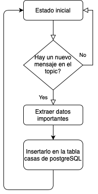

# kiribati-dp2

# Equipo KIRIBATI 
* [Lluis LLoret](https://github.com/luisllll)
* [Marco Colapietro](https://github.com/Marcolapietro)
* [Gonzalo Alberola](https://github.com/GonzaloAP97)
* [Marta Álvarez](https://github.com/maalal)
* [Borja Ponz](https://github.com/fbponz)

# 1) kiribati-dp2

Objetivo del proyecto, es disponer de la capacidad de leer información de una cuenta de Twitter y responder en el menor tiempo posible. Hay tres tipos de tweets:
- Cliente -> Donde se nos indica el nombre del cliente, su edad, miembros de la familia, sueldo y hobbies.
- Casas -> Donde se indica la localización de la casa, el coste de alquiler mensual y un código de la vivienda.
- Empleos -> Lista de empleos con sueldo neto.

Una vez leídos los tweets, se cruza la información obtenida y se busca el mejor match de las opciones disponibles. Se responde al tweet de cliente, tan rápido como sea posible. El algoritmo para hacer match está descrito en el algoritmo 2.3. 

## 1.1) Video 
Enlace video demostrativo del MVP [Youtube](https://www.youtube.com/watch?v=WqeDbgOq7YE) 
 

# 2) MVP
## 2.1) Arquitectura 
Para la resolución de la problemática planteada hemos decidido implementar la siguiente arquitectura.
 

 
NIFI: El objetivo principal es poder ingestar los datos a través de la API que nos proporciona Twitter. Una vez recibimos respuesta de la API tenemos que filtrar por un lado los tweets que no nos interesan y también datos que no interesan para la ejecución de la aplicación. También separamos los tweets en dos clases Clientes y Casas. Se ha escogido Nifi por la versatilidad que nos ofrece para realizar prototipos y ajustarnos a unas necesidades cambiantes.

Kafka: Kafka, nos permite realizar una gestión de eventos en tiempo real, añade una latencia baja al sistema y nos permite comunicar las diferentes aplicaciones que componen nuestra arquitectura. En esta aplicación vamos a tener dos topics, uno de ellos incluirá los tweets de los clientes y otro tweets los datos de las casas.

Python: Con el objetivo de probar el concepto de hacer match entre los tweets de casas y los tweets de cliente

PostgreSQL: Para persistir los datos importantes de los pisos disponibles en nuestra aplicación.
Docker: Es la base sobre la que se sustenta el poder desplegar nuestra solución.

### 2.1.1) Prerequesitos

Para poner el siguiente MVP en funcionamiento tenemos que disponer de unas claves para acceder a la API de twitter, para ello vamos a la siguiente pagina.

    https://developer.twitter.com/en/apply-for-access

Una vez disponemos de claves disponemos de las siguientes claves:
* API Key.
* API Secret Key.
* Access token.
* Access token secret.

### 2.1.2) Configuración
 
En el siguiente apartado vamos a detallar las configuraciones necesarias para el correcto funcionamiento del data project.
 

#### 2.1.2.1) Apache NIFI 
 
Para la ingestión de los datos se ha utilizado Apache NIFI. En la carpeta NIFI se encuentra el template desarrollado. Cuando se añade el template antes de ponerlo en ejecución hay que añadirle las claves que hemos obtenido en el apartado 2.1.1) Prerequisitos.

Nifi se encuentra en mapeado en el puerto 8090 por lo tanto para acceder lo haremos a través del navegador en la siguiente dirección http://localhost:8080.

Una vez se ha cargado el template observamos lo siguiente.

Disponemos de tres procesadores de nifi:
* GetTwitter: Lo utilizamos para capturar los tweets desde la cuenta de @dlpexercisepro1. En la configuración de este procesador es donde se tienen que incluir las claves que hemos obtenido en la API de twitter.
* FiltradoTweets: Es un process group que explicaremos a continuación
* PublishKafka: Se encarga de publicar en los topics de kafka, la información de los tweets.

En el process group "FiltradoTweets" tenemos los siguientes procesadores.

* EvaluateJsonPath: Lo utilizamos para obtener datos relevante de los tweets que recibimos.
* JoltTransformJSON: Se filtran los campos que no nos interesan para la aplicación y así reducimos la cantidad de datos que se envian entre los diferentes componentes.
* RouteOnAttribute: Con los datos obtenidos en el procesador EvaluateJsonPath, segregamos para quedarnos solo con los tweets que nos interesan.

A la salida de RouteOnAttribute tenemos dos posibles ficheros por un lado el de cliente y por otro lado el de casas.
    
Ejemplo tweet de cliente después de filtrarlo.

    {
        "created_at" : "Tue Feb 02 21:53:06 +0000 2021",
        "id" : [ 1356722335328395269, 1258295785260756992 ],
        "text" : "My name is Lori Allen, my salary is 135434€ yearly and I am 47 years old. My family are 4 members. These are my hob… https://t.co/ln6TLjuoVy",
        "name" : "dlpexerciseprocess",
        "screen_name" : "dlpexercisepro1",
        "full_text" : "My name is Lori Allen, my salary is 135434€ yearly and I am 47 years old. My family are 4 members. These are my hobbies: Beach(4), City(6), Nature(6), Party(10)  #mdaedem"
    }
Ejemplo tweet de casa después de filtrarlo.

    {
        "created_at" : "Tue Feb 02 21:53:21 +0000 2021",
        "id" : [ 1356722399253831681, 1258295785260756992 ],
        "text" : "A house in Sevilla is free for renting, with 3 rooms available and a monthly cost of 1076€ with code 155692 #mdaedem",
        "name" : "dlpexerciseprocess",
        "screen_name" : "dlpexercisepro1"
    }

#### 2.1.2.2) Apache Kafka
 
El sistema actual, dispone de dos topics, por uno se envían los tweets de casas casasTK y por otro se envían los tweets de clientes clientesTK. Como ya se conoce para funcionar Kafka debemos disponer también de Zookeeper en nuestro Setup.

#### 2.1.2.3) Procesado.
 
Con el objetivo de probar el concepto de hacer match entre los tweets de casas y los tweets de cliente. Se disponen de dos scripts diferentes uno está contenido en el contenedor CasasDP2 y el otro en ClienteDP2. Si se quiere ejecutarlos basta con poner en marcha el contenedor. En caso de que no tenga creado el topic CasasTK o ClientesTK respectivamente los contenedores estarán reiniciandose constantemente hasta que el topic haya sido creado.

En la rutina Casa tenemos implementado el siguiente flujo de programa, la ultima acción "Insertarlo en la tabla casas de postgreSQL" nos referimos a la tabla descrita en el apartado 2.1.2.3).

La rutina de cliente dispone del siguiente flujo, En la acción "Calcular Ciudad en base a los hobbies" se implementa el algoritmo descrito en el apartado 2.1.2.3.1. Una vez disponemos del nombre de la ciudad realizamos una query sobre la base de datos de postgreSQL con los siguientes parámetros, nombre_ciudad = calculada por el algoritmo, el numero de habitaciones tiene que ser igual o mayor al numero de familiares y la renta debe estar por encima del 30%.

##### 2.1.2.3.1) Algoritmo de decisión

Para el algoritmo de decisión del primer MVP se propone gastar una suma de productos de cada puntuación por cada una de las ciudades, actualmente disponemos de cuatro rankings por cada una de las ciudades. El algoritmo que vamos a utilizar es el siguiente:
 
        Puntuación_ciudad= Sumatorio(rank_x * Preference_x)

 

Donde Rank es el valor que tenemos en una tabla y X simboliza cada una de las siguientes categorías (Beach/City/Nature/Party) Por otro lado Preference es el valor que obtenemos del tweet de cliente con la importancia que le da a cada categoría el cliente.

#### 2.1.2.3) Base de datos 

La base de datos postgreSQL está mapeada en el puerto 5432. Durante la inicialización se crean la tabla necesaria para el correcto funcionamiento del data project 2. La siguiente tabla es la única que se implementa en este MVP.
 

 

La base de datos está configurada en el puerto 5432, en este MVP hemos prescindido del entorno gráfico PGAdmin, por ello si queremos acceder para operar con la tabla lo tenemos que hacer como está descrito en las siguientes lineas
    
    $ docker exec -i -t postgresDP2 /bin/bash
    
    # psql -d kiritweet -U kiriuser
    
    # select * from casas; 
(Una vez estamos loggeados en la base de datos, ya podemos realizar consultas mediante SQL).
#### 2.1.2.4) METABASE 

Para acceder al panel de business Intelligence. Se debe realizar desde el navegador en la siguiente dirección http://localhost:3000 haciendo uso de las siguientes credenciales:
 

## 2.2) Ejecución MVP data project en local

### 2.2.1) Preparación ejecutar

Antes de poder ejecutar el MVP tenemos que realizar un paso previo. Debemos ejecutar los siguientes comandos

Debemos de posicionarnos en la carpeta clientes, que se encuentra dentro de la carpeta kiribati-dp2
    cd {$tu_url}kiribati-dp2/clientes
Una vez estamos en la siguiente carpeta debemos hacer una copia del fichero "twitterkeys_template.csv"
    cp twitterkeys_template.csv twitterkeys.csv
Ahora debemos abrir dicho fichero con un editor de texto y modificar las etiquetas de la segunda linea. Por los valores obtuvimos en el apartado 2.1.1) Prerequisitos.

### 2.2.2) Lanzar el contenedor de docker

Para ejecutar el sistema del MVP es necesario descargar el repositorio y mediante el uso de la terminal consola, Lanzar el siguiente comando.
    $ docker-compose build

Una vez hemos compilado las imágenes de nuestro dataproject vamos a ejecutar el siguiente comando para poner el DP en marcha.

    $ docker-compose up -d

Una vez se ha terminado de trabajar se recomienda parar el contenedor, utilizando el siguiente comando.

    $ docker-compose stop

Después de cada pull ejecutaremos el siguiente comando antes de poner el contenedor en marcha.

    $ docker-compose build

## 2.3) Pasos ejecutar en maquina virtual.

Antes de crear la maquina virtual debemos crear la configuración que vamos a necesitar aplicar en la maquina virutal. Para ello nos dirigimos a la dirección https://console.cloud.google.com, Aquí navegamos hasta VPC Network -> Firewall.
Una vez en este punto debemos crear una regla del firewall Debemos seleccionar que la dirección del trafico es al ingresar, en Target Tags especificamos con que nombre queremos utilizar dicha regla. y especificamos por un lado los rangos de IPs en nuestro caso 0.0.0.0/0 y por otro los puertos que vamos a utilizar en nuestro caso 8090 puesto que Nifi es el único que vamos a gastar desde el exterior. 

Una vez tenemos las reglas de configuración creada pasamos a crear la maquina virtual. Se recomienda crear la maquina virtual con la imagen "Container Optimied OS" y con 30GB de disco duro. Debemos crear habilitar las conexiones HTTP y HTTPS, así como indicarle que vamos a gastar la regla que hemos definido previamente.

Entramos en la maquina virtual mediante el SSH, una vez estamos dentro vamos a realizar una serie de pasos para configurar la extensión de docker compose.

Para ello lo primero que hacemos es correr un contenedor del compose

    $ docker run docker/compose:1.27.4

Una vez tenemos descargada la imagen, tenemos que pasar a crear un alias

    echo alias docker-compose="'"'docker run \
        -v /var/run/docker.sock:/var/run/docker.sock \
        -v "$PWD:$PWD" \
        -w="$PWD" \
        docker/compose:1.27.4'"'" >> ~/.bashrc

Una vez hemos añadido en la última fila del fichero bashrc debemos recargar la configuración del terminal para poder gastarlo.

Para esto disponemos de dos formas, cerrar y abrir la instancia. O ejecutando el siguiente comando.

    source ~/.bashrc

Una vez tenemos instalado el docker-compose vamos a proceder a descargar el fichero o subir el repositorio a la maquina virtual. para ello hacemos  uso del siguiente script.

    git clone git@github.com:fbponz/kiribati-dp2.git

Una vez ejecutes este comando te solicitara una respuesta, debe escribir "yes" y darle a la tecla intro.

Con el repositorio kiribati-dp2 descargado ya en la maquina virtual lo siguiente es posicionarnos en la carpeta raíz del repositorio, donde se encuentra el fichero docker-compose y ejecutamos los comandos que hay en el apartado  "2.2.2)Lanzar el contenedor de docker"

Si has llegado hasta aquí, gracias por leer nuestra información del data project.

# 3) Lineas de mejora

- Modificar el procesado basado en python por flink.
- Quitar NIFI e introducir Kafka Connect para ingestar datos desde twitter.
- Cambiar postgreSQL por Redis.
- Añadir Jenkins CI/CD.
- Añadir Kubernetes.
- Añadir ElasticSearch y kibana.

# Kiribati Team
